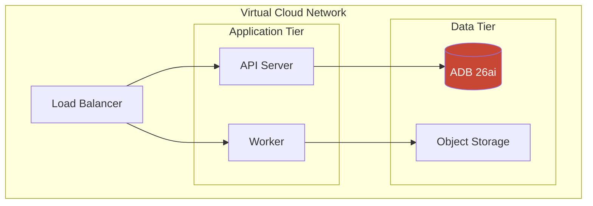

# Oracle Diagram Generator

Generate professional Oracle Cloud Infrastructure (OCI) architecture diagrams using official Oracle icons and templates.

## Quick Reference

**When to Use**: Creating OCI architecture diagrams for presentations, documentation, or customer proposals
**Best Approach**: Use official Oracle toolkit templates as starting point
**Output Formats**: Draw.io (recommended), Python diagrams library, Mermaid.js (text-only)

## Important: How OCI Icons Actually Work

OCI icons in Draw.io are **embedded PNG images** (base64-encoded), not simple shape references. This means:

1. **Draw.io**: Must use official Oracle toolkit as template - icons cannot be generated from shape names
2. **Python diagrams**: Can generate programmatically with proper library installation
3. **Mermaid.js**: Text-only representation - no actual icons, just boxes with labels

## Official Oracle Resources

### Download Links (as of 2026)
- **Draw.io Toolkit**: https://docs.oracle.com/iaas/Content/Resources/Assets/OCI-Style-Guide-for-Drawio.zip
- **PowerPoint Icons**: https://docs.oracle.com/iaas/Content/Resources/Assets/OCI_Icons.pptx
- **Visio Icons**: https://docs.oracle.com/iaas/Content/Resources/Assets/OCI_Icons_Visio.zip
- **Documentation**: https://docs.oracle.com/en-us/iaas/Content/General/Reference/graphicsfordiagrams.htm

### Local Copies (in this repo)
```
docs/diagrams/templates/
├── OCI Architecture Diagram Toolkit v24.2.drawio  # Full template with examples
├── OCI Library.xml                                 # Icon library for Draw.io
└── oci-icon-catalog.json                          # Extracted icon metadata
```

## Workflow Options

### Option 1: Draw.io with Official Toolkit (RECOMMENDED)

**Best for**: Visual editing, presentations, customer-facing documents

**Steps**:
1. Open `docs/diagrams/templates/OCI Architecture Diagram Toolkit v24.2.drawio` in Draw.io
2. Navigate to the "Icons" page to see all available icons
3. Navigate to "Physical" or "Logical" pages for architecture templates
4. Copy icons and templates to a new diagram
5. Customize layout, labels, and connections

**Import Library**:
1. In Draw.io: File → Open Library From → Device
2. Select `docs/diagrams/templates/OCI Library.xml`
3. Icons appear in left sidebar under "OCI Library"

### Option 2: Python Diagrams Library (Programmatic)

**Best for**: CI/CD automation, documentation-as-code, reproducible diagrams

**Installation**:
```bash
pip install diagrams
# Requires Graphviz
brew install graphviz  # macOS
apt install graphviz   # Ubuntu/Debian
```

**Example Code**:
```python
from diagrams import Diagram, Cluster
from diagrams.oci.compute import VM, Container
from diagrams.oci.database import AutonomousDatabase
from diagrams.oci.network import LoadBalancer, Vcn
from diagrams.oci.storage import ObjectStorage

with Diagram("OCI RAG Architecture", show=False, direction="TB"):
    with Cluster("VCN"):
        lb = LoadBalancer("Load Balancer")

        with Cluster("Application Tier"):
            apps = [Container("API"), Container("Worker")]

        with Cluster("Data Tier"):
            adb = AutonomousDatabase("ADB 26ai")
            storage = ObjectStorage("Documents")

    lb >> apps >> adb
    apps >> storage
```

**Output**: PNG/SVG file with proper OCI icons

### Option 3: Mermaid.js (Text-based)

**Best for**: Markdown documentation, quick sketches, version-controlled diagrams

**Note**: No actual OCI icons - uses standard shapes with labels



## Oracle Brand Guidelines

### Colors
| Element | Hex | Usage |
|---------|-----|-------|
| Oracle Red | `#C74634` | Primary accent, icon fills |
| Oracle Dark | `#312D2A` | Text, borders |
| Background Light | `#F5F4F2` | Container backgrounds |
| Border Gray | `#9E9892` | Strokes, separators |

### Typography
- **Font**: Oracle Sans (or Arial as fallback)
- **Headers**: Bold, 14-16px
- **Labels**: Regular, 11-12px

### Layout Principles
- Use rounded rectangles for groupings (VCN, Subnet, Cluster)
- Dashed borders for logical groupings
- Solid borders for physical boundaries
- Consistent spacing: 20px between icons, 40px between groups

## Architecture Patterns

### Pattern 1: Three-Tier Web App
```
┌─────────────────── VCN ───────────────────┐
│ ┌── Public Subnet ──┐ ┌─ Private Subnet ─┐│
│ │    [Load Balancer]│ │    [Compute]     ││
│ │         ↓         │ │       ↓          ││
│ └───────────────────┘ │  [Autonomous DB] ││
│                       └──────────────────┘│
└───────────────────────────────────────────┘
```

### Pattern 2: RAG Platform
```
[Data Sources] → [Streaming] → [Functions]
                                    ↓
                            [GenAI Embed]
                                    ↓
[Chat UI] ← [Cohere Command A] ← [ADB Vector Search]
```

### Pattern 3: Multi-Agent System
```
            [Agent Hub]
                ↓
         [Supervisor Agent]
        ↙     ↓     ↘
   [Agent A] [Agent B] [Agent C]
        ↘     ↓     ↙
           [Tool Layer]
                ↓
            [ADB 26ai]
```

## Generation Commands

When asked to generate an OCI diagram:

1. **Identify architecture type**: RAG, Agent, Web App, Analytics, etc.
2. **List OCI services required**: ADB, Compute, GenAI, etc.
3. **Choose output format**:
   - Draw.io template for visual editing
   - Python code for automation
   - Mermaid for documentation
4. **Apply Oracle styling**: Colors, fonts, spacing
5. **Add annotations**: Cost estimates, service details

## Related Skills

- `oracle-ai-architect` - Architecture patterns and AI service details
- `oci-services-expert` - Service pricing and capabilities
- `oracle-adk` - Agent orchestration patterns

---

*Create professional OCI diagrams using official Oracle assets and proven architectural patterns.*
